# Diagrama de Estados da IHM — UR-DI151399 (SUI-DI141388XY)

Documento normativo de projeto do firmware de aplicacao da Unidade Remota.
Fonte primaria: Manual do Cliente SUI-DI141388XY rev.2026 (`manual.txt`, citado como `L<linha>`).
Fontes secundarias: esquematicos DE-PURI-DI261924 folhas 1/2 e 2/2, PUSI-DI261930, e o firmware ja validado no repositorio.

**Regra de leitura deste documento:** tudo que o manual escreve literalmente aparece entre aspas e com a citacao da linha. Tudo que o manual **nao** especifica esta marcado com `[PEND Dn]` (depende da decisao de numero *n*, ainda nao aprovada) ou `[LACUNA]` (nem o manual nem nenhuma decisao numerada resolvem; exige decisao do bigboss antes da implementacao). Nenhum estado, tempo ou texto foi inventado sem essa marcacao.

---

## 1. Convencoes

### 1.1 Teclas

O painel tem **tres** teclas (L23). No diagrama mermaid elas aparecem como `MENU`, `UP`, `DOWN` (restricao de caracteres); nas tabelas aparecem como no manual.

| No diagrama | No manual | Pino (board_pins.h) | Observacao eletrica |
|---|---|---|---|
| `MENU` | MENU | `kBtnMenu = IO35` (CN3-3) | input-only, **sem** pull-up interno; pull-up tem de vir da placa de IHM |
| `UP` | ▲ | `kBtnUp = IO15` (CN3-1) | unico com pull-up interno; e pino de strapping (MTDO) |
| `DOWN` | ▼ | `kBtnDown = IO34` (CN3-2) | input-only, **sem** pull-up interno |

### 1.2 Gestos e tempos

| Gesto | Definicao | Fonte |
|---|---|---|
| Toque curto | prensagem 30 ms a 600 ms, medida apos o debounce de 20 ms (`kBtnDebounceMs`) | `[PEND D1]` (o manual nunca define duracao de toque) |
| Toque longo (hold) | prensagem continua de **3000 ms**; dispara na **borda** de atingir o limiar, com a tecla ainda prensada | L81, L101, L165, L169, L189, L226 ("aproximadamente 3 segundos"); borda-em-vez-de-soltura e `[PEND D1]` |
| Duplo toque | dois toques completos; intervalo entre soltura e nova prensagem <= 400 ms; gesto total <= 1600 ms; qualquer borda de MENU ou ▼ na janela anula; um terceiro toque anula | L152 ("duplo acionamento da tecla ▲ (PSET)"); numeros sao `[PEND D1]` |
| ▲ e ▼ com hold | **sem funcao** em todos os estados, exceto ▲ mantida na energizacao (L234). Um gesto sem funcao declarada deve ser **ignorado**, nunca reinterpretado como toque curto | `[PEND D1]` |

### 1.3 Temporizacoes globais

| Constante | Valor | Fonte |
|---|---|---|
| `T_HOLD` (confirmar/gravar, abrir login) | 3000 ms | L81, L101, L165, L173, L189, L226 |
| `T_LOGIN_TIMEOUT` | 120 s de inatividade -> Modo Normal | L96 ("aproximadamente 2 minutos") |
| `T_PROG_TIMEOUT` | 120 s sem tecla -> Modo Normal | L127 |
| `T_AUTOTESTE` | 2000 ms | `[PEND D12]`; **conflita com D7**, que propoe 1000 ms |
| `T_LOGO` | 1500 ms | `[PEND D12]` e `[PEND D7]` (os dois concordam em 1500 ms) |
| `T_MSG_ERRO_SENHA` | 2000 ms proposto | L94 diz apenas "por alguns segundos" — `[LACUNA]` |
| `T_MSG_OK` ("Alteracao bem sucedida!") | 1500 ms | `[PEND D2]` |
| `T_MSG_FALHA` (recusa/erro) | 3000 ms | `[PEND D1]`, `[PEND D2]`, `[PEND D9]` |
| `T_PSET_PISCA` | 3 ciclos de 200 ms aceso / 200 ms apagado = 1200 ms | L152 diz so "O display piscará"; numeros sao `[PEND D1]` |
| `T_RESET_HOLD` | ▲ prensada de t=50 ms a t=3000 ms apos o reset | L234-L236 nao dao tempo — `[PEND D1]` |
| `T_RESET_MSG` | >= 2000 ms | L236 nao da tempo — `[PEND D1]` |
| `T_RESET_ABORTA` | t=13000 ms com ▲ ainda prensada -> aborta sem apagar nada | `[PEND D1]` |
| `T_VERIF_NEG` | 20 s | `[PEND D10]` (passo que nao existe no manual) |

### 1.4 Notacao de pendencia no diagrama

`[PEND Dn]` no rotulo do estado = **o estado inteiro, ou o texto de tela, ou o gesto que o alcanca, depende da decisao n**. Nenhum desses estados pode ir para producao antes da aprovacao.

---

## 2. Diagrama de estados

```mermaid
stateDiagram-v2
    direction TB

    %% ---------- declaracao de estados ----------

    state "A1 DESENERGIZADO" as A1
    state "A2 BOOT_AMOSTRA - le as 3 teclas em t=50 ms [PEND D1]" as A2
    state "A3 RESET_ARMADO - UP mantida, conta ate 3 s [PEND D1]" as A3
    state "A4 RESET_MSG - tela 'RESET DE FABRICA'" as A4
    state "A5 RESET_TECLA_PRESA - tela 'TECLA PRESA' [PEND D1]" as A5
    state "A6 AUTOTESTE - padrao de verificacao do display [PEND D12]" as A6
    state "A7 LOGO - logomarca Di-Eletrons" as A7

    state MODO_NORMAL {
        state "B1 NORMAL_PRINCIPAL - X, Y, 4 limites, link, modo AO, preset [PEND D3]" as B1
        state "B2 NORMAL_DET_X - detalhe do eixo X [PEND D3]" as B2
        state "B3 NORMAL_DET_Y - detalhe do eixo Y [PEND D3]" as B3
        state "B4 PSET_PISCA - campo de medicao pisca 3 ciclos [PEND D1]" as B4
        state "B5 PSET_RECUSA_DADO - tela 'PSET recusado!' [PEND D1]" as B5
        state "B6 PSET_RECUSA_INSTAVEL - tela 'Instavel, refaca!' [PEND D1]" as B6
        state "B7 FALHA_COMM - tela 'FALHA DE COMUNICACAO' [PEND D7 D8]" as B7
        state "B8 FORA_DE_FAIXA - tela 'INCLINACAO FORA DE FAIXA' [PEND D11]" as B8
    }

    state ACESSO {
        state "C1 LOGIN_EDIT - tela 'Senha de acesso:0000', digito piscando" as C1
        state "C2 LOGIN_ERRO - tela 'Senha incorreta!'" as C2
    }

    state MODO_PROGRAMACAO {
        state "D1 MENU_TOPO - 10 itens, ordem literal do manual" as D1
        state "D2 SUB_PRESET - 'Preset>Voltar Preset X Preset Y'" as D2
        state "D3 SUB_AUTOCAL - Voltar / Auto Cal X / Auto Cal Y [PEND D3]" as D3
        state "D4 SUB_LIMITE_N - Voltar / Valor Limite / Operacao Limite [PEND D3]" as D4
        state "D5 SUB_SENTIDO - Voltar / Sentido X / Sentido Y [PEND D3]" as D5
        state "D6 ITEM_FILTRO - item novo, fora do menu impresso [PEND D4]" as D6

        state "E1 EDIT_PRESET - 4 digitos mais sinal, digito piscando" as E1
        state "E2 EDIT_LIM_VALOR - tela 'Valor Limite X1(g):+000,0'" as E2
        state "E3 EDIT_LIM_OPER - Off / maior-igual / menor-igual / modulo [PEND D3]" as E3
        state "E4 EDIT_SENTIDO - Horario / Anti-horario" as E4
        state "E4b AVISO_SENTIDO - refazer Preset e conferir limites [LACUNA]" as E4b
        state "E5 EDIT_SENHA - tela 'Edita senha:1234'" as E5
        state "E6 EDIT_FILTRO - 0,0s / 0,2s / 0,8s / 3,2s [PEND D4]" as E6
        state "E7 GRAV_OK - tela 'Alteracao bem sucedida!'" as E7
        state "E8 GRAV_FALHA - tela 'Falha de gravacao!' [PEND D2]" as E8

        state "F1 CAL_ZERO - tela 'Ajuste 0Vcc:0000'" as F1
        state "F2 CAL_FS - tela 'Angulo fim de escala X(g):+045,0'" as F2
        state "F3 CAL_GANHO - tela 'Ajuste 10Vcc:0000'" as F3
        state "F4 CAL_VERIF_NEG - tela 'Verifique -10Vcc' [PEND D10]" as F4
        state "F5 CAL_OK - tela 'Alteracao bem sucedida!'" as F5
        state "F6 CAL_RECUSA - tela 'Calibracao recusada!' [PEND D9 D10]" as F6
    }

    %% ---------- transicoes ----------

    [*] --> A1
    A1 --> A2 : energiza
    A2 --> A3 : UP prensada, MENU e DOWN soltas
    A2 --> A6 : nenhuma tecla prensada
    A2 --> A6 : UP mais MENU ou UP mais DOWN prensadas, aborta reset
    A3 --> A6 : UP solta antes de 3 s, aborta reset
    A3 --> A4 : UP mantida ate t=3000 ms
    A4 --> A5 : UP ainda prensada em t=13000 ms
    A5 --> A6 : apos 3 s, nada e apagado
    A4 --> A6 : UP solta apos a mensagem, carrega Tabela 2
    A6 --> A7 : apos T_AUTOTESTE
    A7 --> B1 : apos T_LOGO

    B1 --> B2 : DOWN curto
    B2 --> B3 : DOWN curto
    B3 --> B1 : DOWN curto
    B1 --> B4 : UP duplo, dado valido e estavel
    B2 --> B4 : UP duplo, dado valido e estavel
    B3 --> B4 : UP duplo, dado valido e estavel
    B4 --> B1 : fim do pisca, 1200 ms
    B1 --> B5 : UP duplo, status do sensor diferente de 0x0001
    B5 --> B1 : apos 3 s
    B1 --> B6 : UP duplo, leitura instavel
    B6 --> B1 : apos 3 s
    B1 --> B7 : ciclos invalidos consecutivos
    B7 --> B1 : ciclos validos consecutivos
    B1 --> B8 : modulo do angulo bruto maior que 90,0 graus
    B8 --> B1 : angulo bruto volta a faixa
    B1 --> C1 : MENU mantida 3 s
    B7 --> C1 : MENU mantida 3 s

    C1 --> C1 : MENU curto move o digito, UP e DOWN alteram
    C1 --> D1 : MENU 3 s, senha correta
    C1 --> C2 : MENU 3 s, senha incorreta
    C2 --> C1 : apos T_MSG_ERRO_SENHA
    C1 --> B1 : timeout 120 s

    D1 --> B1 : item Voltar ou item Sair mais MENU curto
    D1 --> D2 : item Ajusta Preset mais MENU curto
    D1 --> D3 : item Auto Calibracao mais MENU curto
    D1 --> D4 : item Limite 1 a 4 mais MENU curto
    D1 --> D5 : item Sentido Sensor mais MENU curto
    D1 --> D6 : item Filtro mais MENU curto
    D1 --> E5 : item Senha mais MENU curto

    D2 --> D1 : item Voltar mais MENU curto
    D2 --> E1 : Preset X ou Preset Y mais MENU curto
    E1 --> E7 : MENU 3 s, valor na faixa, NVS gravada
    E1 --> E8 : MENU 3 s, falha de gravacao
    E1 --> E1 : MENU 3 s, valor fora da faixa, recusa

    D3 --> D1 : item Voltar mais MENU curto
    D3 --> F1 : Auto Calibracao X ou Y mais MENU curto
    F1 --> F2 : MENU 3 s, confirma o zero
    F2 --> F3 : MENU 3 s, fundo de escala de 0,1 a 90,0 graus
    F2 --> F2 : MENU 3 s, fundo de escala igual a 000,0, recusa
    F3 --> F4 : MENU 3 s, span dentro da tolerancia
    F3 --> F6 : MENU 3 s, span fora da tolerancia
    F6 --> F3 : apos 3 s
    F4 --> F5 : MENU curto ou 20 s
    F5 --> B1 : apos 1500 ms, retorna ao Modo Normal

    D4 --> D1 : item Voltar mais MENU curto
    D4 --> E2 : item Valor Limite mais MENU curto
    D4 --> E3 : item Operacao Limite mais MENU curto
    E2 --> E7 : MENU 3 s, valor na faixa
    E2 --> E8 : MENU 3 s, falha de gravacao
    E3 --> E7 : MENU 3 s
    E3 --> E8 : MENU 3 s, falha de gravacao

    D5 --> D1 : item Voltar mais MENU curto
    D5 --> E4 : Sentido Sensor X ou Y mais MENU curto
    E4 --> E4b : MENU 3 s, gravado
    E4b --> D5 : MENU curto ou 5 s

    D6 --> E6 : MENU curto
    E6 --> E7 : MENU 3 s

    E5 --> E7 : MENU 3 s, nova senha gravada
    E5 --> E8 : MENU 3 s, falha de gravacao

    E7 --> D1 : apos 1500 ms, volta ao nivel de origem
    E8 --> D1 : apos 3 s, restaura o valor anterior

    MODO_PROGRAMACAO --> B1 : timeout 120 s sem tecla
    MODO_PROGRAMACAO --> B7 : perda de link, sem roubar a tela

    note right of MODO_PROGRAMACAO
      Os 4 reles continuam avaliando o angulo REAL
      em todos os estados C, D, E e F. [PEND D6]
    end note

    note right of F1
      Ordem obrigatoria zero antes do ganho (L178).
      Nao ha caminho de F2 ou F3 de volta a F1.
    end note
```

> Nota sobre o diagrama: os rotulos usam `g` no lugar do simbolo de grau e `maior-igual` / `menor-igual` no lugar de `>=` / `<=` apenas por restricao de caracteres do mermaid. O texto **literal** de cada tela esta nas tabelas do item 3, byte a byte.

---

## 3. Catalogo de estados

Colunas: o que o display mostra (texto literal entre aspas quando o manual o publica) e o que cada tecla faz em cada gesto. Onde ha `-`, o gesto **nao tem funcao** e deve ser ignorado.

### 3.1 Grupo A — Energizacao, autoteste e Reset de Fabrica

| ID / Nome | Display | MENU curto | MENU 3 s | ▲ curto | ▲ duplo | ▲ mantida | ▼ curto | Saida automatica | Pendencia |
|---|---|---|---|---|---|---|---|---|---|
| **A1 DESENERGIZADO** | apagado | - | - | - | - | arma o Reset de Fabrica se ja estiver prensada na energizacao (L234) | - | energizacao -> A2 | — |
| **A2 BOOT_AMOSTRA** | apagado (t = 0..50 ms) | - | - | - | - | amostrada em t=50 ms | - | 50 ms -> A3 ou A6 | `[PEND D1]` (o manual nao define o instante da amostragem nem o aborto por combinacao de teclas) |
| **A3 RESET_ARMADO** | apagado | - | - | - | - | **tem de continuar prensada** ate t=3000 ms | - | 3000 ms -> A4; soltura antes disso -> A6 | `[PEND D1]` (tempo de retencao inexistente no manual) |
| **A4 RESET_MSG** | `RESET DE FABRICA` (L237, caixa alta, sem acento) | - | - | - | - | **soltar** executa o reset e carrega a Tabela 2 (L238-L239) | - | >= 2000 ms e ▲ solta -> A6; ▲ ainda prensada em t=13000 ms -> A5 | `[PEND D1]` (o manual nao define duracao nem o que fazer com tecla presa) |
| **A5 RESET_TECLA_PRESA** | `TECLA PRESA` | - | - | - | - | ignorada | - | 3000 ms -> A6, **sem apagar nada** | `[PEND D1]` (estado inteiro nao existe no manual) |
| **A6 AUTOTESTE** | padrao de verificacao: moldura de 1 px, regua com marcas em x = 0/64/128/192/255 e o texto `SSD1322 256x64 FW <versao>` | - | - | - | - | - | - | `T_AUTOTESTE` -> A7 | `[PEND D12]`; L66 promete o autoteste mas nao diz o que ele testa nem quanto dura. **Conflito**: D12 = 2000 ms, D7 = 1000 ms |
| **A7 LOGO** | logomarca Di-Eletrons (L68, "exibida temporariamente") | - | - | - | - | - | - | `T_LOGO` -> B1 | `[PEND D12]` (duracao) |

Notas do grupo A:
- O gesto de reset e de **tecla unica** (▲). L31 diz "por meio das teclas de programação" (plural); e erro de texto do manual — `[PEND D1]`.
- ▲ e `IO15`, pino de strapping. Prensada no boot, o log da ROM na UART e suprimido; o boot pela flash nao e afetado.
- Como `IO34`/`IO35` nao tem pull-up interno, cabo de IHM solto pode ser lido como MENU e ▼ prensados: por isso A2 aborta o reset quando ▲ vem acompanhada. `[PEND D1]`
- Tela `CONFIG PADRAO DE FABRICA` (5 s) quando os dois bancos de NVS estao invalidos no boot: `[PEND D2]`. Tela `Sem cal. de fabrica` (3 s) quando o registro de calibracao de fabrica falta ou tem CRC ruim: `[PEND D9]`.

### 3.2 Grupo B — Modo Normal

| ID / Nome | Display | MENU curto | MENU 3 s | ▲ curto | ▲ duplo (PSET) | ▼ curto | Saida automatica | Pendencia |
|---|---|---|---|---|---|---|---|---|
| **B1 NORMAL_PRINCIPAL** | leitura dos dois eixos no formato `±XXX,X` (L131), mais estado dos 4 limites, estado do link com a sensora, modo da saida analogica e indicacao de Preset ativo; batimento de 4x4 px a 1 Hz no canto | - | abre a tela de login -> C1 (L81, L88) | - (L85: "Não possui função neste modo") | efetiva o Preset -> B4 / B5 / B6 (L152) | alterna a indicacao -> B2 (L83) | eventos de falha -> B7 / B8 | **`[PEND D3]`**: o manual **nunca** publica o layout literal da tela principal. L60 fala em "valores" (plural, simultaneos) e L83 fala em alternar entre X e Y — contradicao. Limites, link, modo de saida e preset ativo sao acrescimos. Batimento de 1 Hz e `[PEND D12]` |
| **B2 NORMAL_DET_X** | detalhe do eixo X (leitura, limite X1, limite X2, saida analogica X) | - | -> C1 | - | -> B4 | -> B3 | — | `[PEND D3]` (tela inexistente no manual) |
| **B3 NORMAL_DET_Y** | detalhe do eixo Y (leitura, limite Y1, limite Y2, saida analogica Y) | - | -> C1 | - | -> B4 | -> B1 | — | `[PEND D3]` |
| **B4 PSET_PISCA** | o campo de medicao pisca 3 ciclos de 200/200 ms (L152: "O display piscará, indicando que o comando foi aceito") | ignorado | ignorado | ignorado | ignorado | ignorado | 1200 ms -> B1 | `[PEND D1]` (frequencia e duracao do pisca; gravacao imediata do offset em NVS) |
| **B5 PSET_RECUSA_DADO** | `PSET recusado!` | ignorado | ignorado | ignorado | ignorado | ignorado | 3000 ms -> B1 | `[PEND D1]` — estado inexistente no manual. Guarda: so aceita PSET se a ultima transacao respondeu no prazo **e** o registrador 3 da sensora vale **exatamente** `0x0001` |
| **B6 PSET_RECUSA_INSTAVEL** | `Instavel, refaca!` | ignorado | ignorado | ignorado | ignorado | ignorado | 3000 ms -> B1 | `[PEND D1]` — guarda de estabilidade: pico-a-pico <= 0,2 graus em 20 amostras nos dois eixos |
| **B7 FALHA_COMM** | linha 1 `FALHA DE COMUNICACAO`; linha 2 **em conflito** (ver 5.2); pisca a 1 Hz e substitui a area de leitura | - | abre a tela de login -> C1 | - | PSET **recusado** (guarda de dado valido) | alterna a tela, se houver | recuperacao -> B1 | **`[PEND D7]` e `[PEND D8]`**: L297 promete "a mensagem de falha de comunicação" e **nao da o texto**, nao da tempo de deteccao, nao diz o que os reles e as saidas analogicas fazem |
| **B8 FORA_DE_FAIXA** | linha 1 `INCLINACAO FORA DE FAIXA`; linha 2 identifica o eixo culpado | - | -> C1 | - | recusado | - | angulo bruto volta a faixa -> B1 | `[PEND D11]` — estado inexistente no manual; a regra e sobre o angulo **bruto**, antes do Preset |

Notas do grupo B:
- L78 garante apenas que "as saídas analógicas dos eixos X e Y permanecem atualizadas" neste modo; nao menciona os reles em lugar nenhum fora do Modo Normal.
- A tecla ▲ **tem** funcao no Modo Normal (PSET, L152), contra L85. O toque simples continua sem funcao; so o duplo toque age. `[PEND D1]`
- O ciclo de telas `B1 -> B2 -> B3 -> B1` e uma leitura de L83 ("Alterna a indicação do display entre os eixos X e Y") estendida com a tela principal. O manual descreve apenas duas telas (X e Y). `[PEND D3]`

### 3.3 Grupo C — Acesso por senha

| ID / Nome | Display | MENU curto | MENU 3 s | ▲ curto | ▲ duplo | ▼ curto | Timeout | Pendencia |
|---|---|---|---|---|---|---|---|---|
| **C1 LOGIN_EDIT** | `Senha de acesso:0000` (L89); com a senha de fabrica digitada, `Senha de acesso:1234` (L91). O digito em edicao fica **piscando** (L92) | move a selecao "para o dígito à esquerda" (L92) | valida a senha: correta -> D1; incorreta -> C2 (L93-L94) | altera o valor do digito (L92) | - | altera o valor do digito (L92) | 120 s sem tecla -> B1 (L96) | `[LACUNA]`: o manual nao diz em qual digito a edicao comeca, se ha volta (wrap) ao passar do digito mais a esquerda, se ▲/▼ dao a volta de 9 para 0, nem se ha limite de tentativas ou bloqueio |
| **C2 LOGIN_ERRO** | `Senha incorreta!` (L95) | ignorado | ignorado | ignorado | ignorado | ignorado | `T_MSG_ERRO_SENHA` -> C1 ("por alguns segundos antes de desaparecer e permitir uma nova tentativa", L94) | `[LACUNA]`: duracao nao especificada; nao esta dito se C1 reabre com `0000` ou com o valor digitado |

Nota: L73 e L81 afirmam a senha `1234` como se fosse fixa, mas L122 e a secao 5.10 a tornam programavel de `0000` a `9999`. O texto de 5.2 fica incorreto assim que o cliente troca a senha.

### 3.4 Grupo D — Menus

| ID / Nome | Display | MENU curto | MENU 3 s | ▲ curto | ▼ curto | Timeout | Pendencia |
|---|---|---|---|---|---|---|---|
| **D1 MENU_TOPO** | literal de L103, **nesta ordem exata**: `Menu>Voltar   Ajusta Preset   Auto Calibração   Limite 1   Limite 2   Limite 3   Limite 4   Sentido Sensor   Senha   Sair` | abre o item selecionado | - | sobe na lista (nao da a volta) | desce na lista (nao da a volta) | 120 s -> B1 (L127) | O manual nunca diz **qual** tecla sobe e qual desce, nem se a lista da a volta — `[LACUNA]`. O item `Voltar` nunca e definido; `Voltar` e `Sair` fazem a mesma coisa neste nivel — `[PEND D3]`. Insercao do item `Filtro` entre `Sentido Sensor` e `Senha` **quebra a ordem literal** — `[PEND D4]`, em **conflito** com D3 |
| **D2 SUB_PRESET** | literal de L139: `Preset>Voltar   Preset X   Preset Y` | abre o item; `Voltar` -> D1 | - | sobe | desce | 120 s -> B1 | Unico submenu que o manual imprime. `Voltar` do submenu volta ao `Menu>` (nao ao Modo Normal) — `[PEND D3]` |
| **D3 SUB_AUTOCAL** | `Auto Cal>Voltar   Auto Calibracao X   Auto Calibracao Y` | abre o eixo -> F1; `Voltar` -> D1 | - | sobe | desce | 120 s -> B1 | **`[PEND D3]`** — o manual **nao imprime** este submenu, embora a Tabela 1 liste `Auto Calibração X` e `Auto Calibração Y` como parametros distintos (L110-L111) |
| **D4 SUB_LIMITE_N** (4 instancias) | `Limite 1>Voltar   Valor Limite X1   Operacao Limite X1` (idem X2, Y1, Y2) | abre o item; `Voltar` -> D1 | - | sobe | desce | 120 s -> B1 | **`[PEND D3]`** — o manual manda "selecionar o parâmetro Operação Limite ou Limite (1 a 4)" (L202) mas o item `Operação Limite` **nao aparece** no menu de L103; a Tabela 1 o lista (L112, L114, L116, L118). Ordem valor-antes-de-operacao vem de L209 |
| **D5 SUB_SENTIDO** | `Sentido>Voltar   Sentido Sensor X   Sentido Sensor Y` | abre o eixo -> E4; `Voltar` -> D1 | - | sobe | desce | 120 s -> B1 | **`[PEND D3]`** — submenu nao impresso; Tabela 1 lista os dois parametros (L120-L121) |
| **D6 ITEM_FILTRO** | `Filtro` (folha do nivel 1) | abre -> E6 | - | sobe | desce | 120 s -> B1 | **`[PEND D4]`** — L62 e L263 prometem "um filtro passa-baixa, permitindo adequar o tempo de resposta", mas **nao ha parametro de filtro** no menu de L103 nem na Tabela 1 nem na Tabela 2 |

**Conferencia de fechamento (D3):** 2 (Preset X/Y) + 2 (Auto Cal X/Y) + 8 (4 limites x valor+operacao) + 2 (Sentido X/Y) + 1 (Senha) + 1 (Sair) = **16 folhas**, exatamente os 16 parametros da Tabela 1 (L106-L123). A Tabela 1 **nao** tem `Voltar`. Acrescentar `Filtro` leva a 17 e quebra essa conferencia — motivo do conflito D3 x D4.

### 3.5 Grupo E — Editores de parametro

Regra unica de edicao adotada (`[PEND D1]`): **MENU move o cursor; ▲/▼ alteram a posicao selecionada**. O sinal e uma posicao a esquerda dos digitos, onde ▲/▼ alternam `+` e `-`.

| ID / Nome | Display | MENU curto | MENU 3 s | ▲ curto | ▼ curto | Timeout | Pendencia |
|---|---|---|---|---|---|---|---|
| **E1 EDIT_PRESET** | valor no formato `±XXX,X` (L131), faixa `-90,0` a `+90,0` (L108-L109), digito selecionado piscando | seleciona o digito a alterar (L146) | confirma e grava -> E7 (L101) | altera o valor do digito (L147) | altera o valor da posicao selecionada; na posicao do sinal, alterna `+`/`-` | 120 s -> B1 | **Contradicao do manual:** L149 manda **clique curto** em MENU para gravar o Preset, contra a regra geral de L101 (hold de 3 s). Adotado o hold — `[PEND D2]`. **Contradicao interna:** L147-L148 dao a ▼ apenas o sinal, L164/L169/L224 dao a ▼ o valor, e L204 diz as duas coisas na mesma frase — `[PEND D1]` |
| **E2 EDIT_LIM_VALOR** | `Valor Limite X1(°):+000,0` (L205), `Valor Limite X2(°):+000,0` (L206), `Valor Limite Y1(°):+000,0` (L207), `Valor Limite Y2(°):+000,0` (L208); exemplo programado `Valor Limite Y2(°):+025,0` (L211) | seleciona o digito (L204) | confirma e grava -> E7 | altera o valor | altera o valor / o sinal | 120 s -> B1 | L212 manda **clique curto** para gravar, contra L101 — `[PEND D2]`. Faixa `-90,0` a `+90,0` (L113 etc.); o digito das centenas do formato `±XXX,X` nunca e usado e o manual nao diz se ha clamp na confirmacao — `[LACUNA]` |
| **E3 EDIT_LIM_OPER** | linha 1 `Operacao Limite X1:`; linha 2 com simbolo e extensao: `Off (desativado)`, `>= (maior ou igual)`, `<= (menor ou igual)`, `+ (modulo)` | - | confirma e grava -> E7 | opcao anterior (lista fechada, sem volta) | proxima opcao | 120 s -> B1 | **`[PEND D3]`** — o manual descreve as 4 opcoes (L195-L198, Tabela 1) mas **nao publica nenhuma tela** deste editor. Uso de `>=`/`<=` em ASCII no lugar de `≥`/`≤` e desvio declarado |
| **E4 EDIT_SENTIDO** | opcao corrente: `Horário` ou `Anti-horário` (L182-L183, L120-L121) | - | confirma e grava (L189) -> E4b | seleciona a opcao (L188) | seleciona a opcao (L188) | 120 s -> B1 | O manual **nao publica** a tela — `[LACUNA]` |
| **E4b AVISO_SENTIDO** | aviso de que a inversao de sinal exige refazer o Preset e conferir os Limites 1 a 4 | confirma -> D5 | - | - | - | 5 s -> D5 | **`[LACUNA]`** — L190 apenas **recomenda** ("recomenda-se refazer o Preset e conferir os valores programados nos Limites 1 a 4"); o manual **nao diz** se o firmware deve avisar, converter automaticamente ou bloquear. Nenhuma decisao numerada cobre isto |
| **E5 EDIT_SENHA** | `Edita senha:1234` (L222) — abre no valor **corrente**, ao contrario do login, que abre em `0000` | seleciona o digito, que "permanecerá piscando" (L223) | grava a nova senha (L226) -> E7 | ajusta o digito (L224) | ajusta o digito (L224) | 120 s -> B1 | Faixa `0000` a `9999`, padrao `1234` (L122). "A nova senha somente passará a ser utilizada nos próximos acessos" (L228) |
| **E6 EDIT_FILTRO** | `Filtro:0,0s` / `Filtro:0,2s` / `Filtro:0,8s` / `Filtro:3,2s` | - | confirma e grava -> E7 | opcao anterior | proxima opcao | 120 s -> B1 | **`[PEND D4]`** — parametro, tela, faixa e default nao existem no manual |
| **E7 GRAV_OK** | `Alteracao bem sucedida!` (L174 — sem cedilha e sem til, exatamente como impresso) | ignorado | ignorado | ignorado | ignorado | 1500 ms -> nivel de menu de origem | L213 e L227 dizem "retornará automaticamente ao Modo Programação" e L149 diz "retornar ao modo PROGRAMAÇÃO", mas **nao dizem a qual nivel** (topo ou submenu) — `[LACUNA]` |
| **E8 GRAV_FALHA** | `Falha de gravacao!` | ignorado | ignorado | ignorado | ignorado | 3000 ms -> nivel de origem, com o valor anterior restaurado | **`[PEND D2]`** — o manual nao preve falha de gravacao; ele preve apenas perda por queda de energia (L128, L300) |

### 3.6 Grupo F — Wizard de Auto Calibracao

Sequencia **fixa e obrigatoria**, zero antes do ganho: "O ajuste do zero deve ser sempre realizado antes do ajuste do ganho, pois a referência de 0,00 Vcc é utilizada no cálculo da proporção da saída analógica" (L178). **Nao existe** caminho de volta de F2 ou F3 para F1.

| ID / Nome | Display | MENU curto | MENU 3 s | ▲ curto | ▼ curto | Timeout | Pendencia |
|---|---|---|---|---|---|---|---|
| **F1 CAL_ZERO** | `Ajuste 0Vcc:0000` (L163). A UR "passa a simular a inclinação de 0,0°" (L162) e a saida do eixo em calibracao vai ao codigo nominal de 0,00 V | seleciona o digito (L164) | confirma o ajuste do zero (L165) -> F2 | altera o valor (L164) | altera o valor (L164) | 120 s -> B1, **sem gravar** | **`[PEND D9]`/`[PEND D10]`**: o manual **nao diz** o que os 4 digitos representam num D/A de 16 bits (L33), qual a faixa, qual o passo, nem por que a tela abre em `0000`. **Conflito** entre D6, D9 e D10 (ver 5.3) |
| **F2 CAL_FS** | `Angulo fim de escala X(°):+045,0` (L168 — sem circunflexo em "Angulo") | seleciona o digito (L169) | confirma (L169) -> F3 | altera o valor | altera o valor | 120 s -> B1 | Faixa `0,1` a `90,0` graus (L110). O manual **nao diz** o que ocorre com `000,0` (ganho infinito) nem se o campo aceita sinal, embora a tela mostre `+045,0` e a Tabela 1 diga "0,1 a 90,0°" — `[LACUNA]`, coberta por `[PEND D9]` (recusa `000,0`, sinal travado em `+`). O manual **nao publica** a tela equivalente do eixo Y |
| **F3 CAL_GANHO** | `Ajuste 10Vcc:0000` (L171). A UR "passa a simular internamente a inclinação informada" (L170) | seleciona o digito (L172) | grava a calibracao (L173) -> F4 (ou -> F6 se recusada) | altera o valor | altera o valor | 120 s -> B1, **sem gravar** | mesma pendencia de F1 |
| **F4 CAL_VERIF_NEG** | `Verifique -10Vcc`; a UR simula o fundo de escala **negativo** e escreve o codigo espelhado | confirma -> F5 | - | - | - | 20 s -> F5 | **`[PEND D10]`** — passo que **nao existe** no manual. L156 **afirma** a simetria (`-45,0° = -10,00 Vcc`) mas o procedimento de L160-L173 nunca a mede |
| **F5 CAL_OK** | `Alteracao bem sucedida!` (L174) | ignorado | ignorado | ignorado | ignorado | 1500 ms -> **B1** | L175: "Concluída a calibração, o equipamento retorna automaticamente ao Modo Normal de Operação". E o **unico** procedimento que devolve o operador ao Modo Normal em vez do Modo Programacao (contra L213 e L227) |
| **F6 CAL_RECUSA** | `Calibracao recusada!` | ignorado | ignorado | ignorado | ignorado | 3000 ms -> F3, sem gravar | **`[PEND D9]`/`[PEND D10]`** — guarda de plausibilidade do span; nao existe no manual |

Notas do grupo F:
- L158: o procedimento exige voltimetro de precisao conectado ao eixo em calibracao **antes** de iniciar.
- L176: "Inclinações superiores ao fundo de escala mantêm a saída saturada em ±10,00 Vcc" — o clamp e em ±10,00 V, nao no limite eletrico.
- Enquanto o wizard esta ativo, a saida analogica do eixo calibrado **nao representa a inclinacao real**. O manual **nao adverte** sobre isso e **nao diz** se o laco a jusante deve ser inibido — `[PEND D6]`, `[PEND D9]`.

---

## 4. Tabela de transicoes

Uma linha por transicao. `Guarda` entre colchetes. `Fonte` cita a linha do manual quando ela existe; quando nao existe, cita a decisao pendente.

| # | Origem | Evento / guarda | Destino | Efeito | Fonte |
|---|---|---|---|---|---|
| T01 | A1 | energizacao | A2 | reles nos GPIOs em nivel de estado seguro antes de qualquer outra coisa; DAC configurado e levado ao codigo de zero | L66; `[PEND D7]` (ordem e prazo) |
| T02 | A2 | t=50 ms [▲ prensada, MENU e ▼ soltas] | A3 | arma o Reset de Fabrica | L234-L235; `[PEND D1]` |
| T03 | A2 | t=50 ms [nenhuma tecla prensada] | A6 | boot normal | L66 |
| T04 | A2 | t=50 ms [▲ + MENU, ou ▲ + ▼] | A6 | **aborta** o reset (assinatura de cabo em curto) | `[PEND D1]` |
| T05 | A3 | ▲ solta antes de t=3000 ms | A6 | aborta o reset, nada e apagado | `[PEND D1]` |
| T06 | A3 | ▲ mantida ate t=3000 ms | A4 | exibe `RESET DE FABRICA` | L236 |
| T07 | A4 | ▲ solta [t >= 2000 ms de mensagem] | A6 | **executa** o reset: carrega a Tabela 2 (L241-L257) e restaura a calibracao de fabrica das saidas analogicas (L231) | L238-L239 |
| T08 | A4 | t=13000 ms [▲ ainda prensada] | A5 | exibe `TECLA PRESA` | `[PEND D1]` |
| T09 | A5 | 3000 ms | A6 | segue o boot **sem apagar nada** | `[PEND D1]` |
| T10 | A6 | `T_AUTOTESTE` | A7 | fim do autoteste do display | L66, L68; `[PEND D12]` |
| T11 | A7 | `T_LOGO` | B1 | "conclui a sequência de inicialização e passa a operar normalmente" | L68 |
| T12 | B1 | ▼ curto | B2 | alterna a indicacao | L83; telas `[PEND D3]` |
| T13 | B2 | ▼ curto | B3 | alterna a indicacao | L83; `[PEND D3]` |
| T14 | B3 | ▼ curto | B1 | fecha o ciclo de telas | `[PEND D3]` |
| T15 | B1/B2/B3 | ▲ duplo [status da sensora == `0x0001`] e [pico-a-pico <= 0,2 graus nos dois eixos] | B4 | grava `offset := P - dir x bruto` e o Preset ativo em NVS; a nova referencia vale na amostra seguinte | L152; guardas e gravacao imediata `[PEND D1]` |
| T16 | B4 | 1200 ms | B1 | fim do pisca de aceite | L152; tempo `[PEND D1]` |
| T17 | B1/B2/B3 | ▲ duplo [status != `0x0001`] | B5 | recusa o PSET; nada e gravado | `[PEND D1]` |
| T18 | B5 | 3000 ms | B1 | — | `[PEND D1]` |
| T19 | B1/B2/B3 | ▲ duplo [leitura instavel] | B6 | recusa o PSET | `[PEND D1]` |
| T20 | B6 | 3000 ms | B1 | — | `[PEND D1]` |
| T21 | B1/B2/B3 | N ciclos de transacao invalidos consecutivos | B7 | mensagem de falha; **reles e saidas analogicas ao estado de falha** | L297 (so a mensagem); comportamento das saidas `[PEND D7]`/`[PEND D8]` |
| T22 | B7 | M ciclos validos consecutivos | B1 | retorno a medicao; o filtro e recarregado com a primeira amostra boa | L298; numeros `[PEND D7]`/`[PEND D8]` |
| T23 | B1/B2/B3 | modulo do angulo **bruto** > 90,0 graus por 3 ciclos | B8 | falha mecanica de faixa; reles e saidas ao estado de falha | `[PEND D11]` (inexistente no manual) |
| T24 | B8 | angulo bruto volta a faixa | B1 | — | `[PEND D11]` |
| T25 | B1/B2/B3/B7/B8 | MENU mantida 3 s | C1 | abre a tela de login | L81, L88 |
| T26 | C1 | MENU curto | C1 (auto) | move a selecao "para o dígito à esquerda"; o digito selecionado pisca | L92 |
| T27 | C1 | ▲ curto ou ▼ curto | C1 (auto) | altera o valor do digito piscando | L92 |
| T28 | C1 | MENU 3 s [senha correta] | D1 | "o Menu de Opções será exibido" | L93-L94 |
| T29 | C1 | MENU 3 s [senha incorreta] | C2 | exibe `Senha incorreta!` | L94-L95 |
| T30 | C2 | `T_MSG_ERRO_SENHA` | C1 | "permitir uma nova tentativa" | L94; duracao `[LACUNA]` |
| T31 | C1 | 120 s sem tecla | B1 | "cancelará automaticamente a operação e retornará ao Modo Normal" | L96 |
| T32 | D1 | ▲ / ▼ curto | D1 (auto) | navega na lista (sem dar a volta) | L99; qual tecla sobe `[LACUNA]` |
| T33 | D1 | item `Voltar` + MENU curto | B1 | retorna ao Modo Normal | L103 lista o item; comportamento `[PEND D3]` |
| T34 | D1 | item `Sair` + MENU curto | B1 | "selecione o parâmetro SAIR e clique na tecla MENU" | L126, L123 |
| T35 | D1 | item `Ajusta Preset` + MENU curto | D2 | abre `Preset>Voltar   Preset X   Preset Y` | L139 |
| T36 | D1 | item `Auto Calibração` + MENU curto | D3 | abre o submenu de eixo | `[PEND D3]` |
| T37 | D1 | item `Limite N` + MENU curto | D4 | abre o submenu do limite N | `[PEND D3]` |
| T38 | D1 | item `Sentido Sensor` + MENU curto | D5 | abre o submenu de eixo | `[PEND D3]` |
| T39 | D1 | item `Senha` + MENU curto | E5 | exibe `Edita senha:1234` | L220-L222 |
| T40 | D1 | item `Filtro` + MENU curto | D6/E6 | abre o editor de filtro | `[PEND D4]`; **conflita com D3** |
| T41 | D2/D3/D4/D5 | item `Voltar` + MENU curto | D1 | sobe um nivel | `[PEND D3]` |
| T42 | D2 | `Preset X` ou `Preset Y` + MENU curto | E1 | "Pressione a tecla MENU para iniciar a edição" | L144-L145 |
| T43 | E1 | MENU curto | E1 (auto) | seleciona o digito a alterar | L146 |
| T44 | E1 | ▲ curto | E1 (auto) | modifica o valor do digito | L147 |
| T45 | E1 | ▼ curto | E1 (auto) | altera o valor / o sinal da posicao selecionada | L148 x L164 x L204 — contradicao, `[PEND D1]` |
| T46 | E1 | MENU 3 s [valor em -90,0..+90,0] [NVS gravada] | E7 | grava o parametro | L101 (hold) x **L149 (clique curto)** — `[PEND D2]` |
| T47 | E1 | MENU 3 s [valor fora da faixa] | E1 | recusa e permanece na tela | `[PEND D3]` (o manual nao trata) |
| T48 | E1/E2/E3/E5/E6 | MENU 3 s [falha de gravacao] | E8 | restaura o valor anterior e exibe `Falha de gravacao!` | `[PEND D2]` |
| T49 | D3 | `Auto Calibracao X` ou `Y` + MENU curto | F1 | "A Unidade Remota passa a simular a inclinação de 0,0°" e exibe `Ajuste 0Vcc:0000` | L161-L163 |
| T50 | F1 | MENU curto | F1 (auto) | seleciona o digito | L164 |
| T51 | F1 | ▲ / ▼ curto | F1 (auto) | altera o valor, "acompanhando a leitura do voltímetro até que a tensão de saída seja de 0,00 Vcc" | L164 |
| T52 | F1 | MENU 3 s | F2 | confirma o zero; exibe `Angulo fim de escala X(°):+045,0` | L165-L168 |
| T53 | F2 | MENU curto / ▲ / ▼ | F2 (auto) | seleciona digito e altera valor, resolucao de 0,1 graus | L169 |
| T54 | F2 | MENU 3 s [fundo de escala em 0,1..90,0 graus] | F3 | "passa a simular internamente a inclinação informada" e exibe `Ajuste 10Vcc:0000` | L169-L171 |
| T55 | F2 | MENU 3 s [fundo de escala = 000,0] | F2 | recusa (divisao por zero) | `[PEND D9]` |
| T56 | F3 | MENU curto / ▲ / ▼ | F3 (auto) | altera o valor "acompanhando o voltímetro até que a tensão de saída seja de +10,00 Vcc" | L172 |
| T57 | F3 | MENU 3 s [span plausivel] | F4 | grava a calibracao na memoria nao volatil | L173; passo F4 `[PEND D10]` |
| T58 | F3 | MENU 3 s [span fora da tolerancia] | F6 | recusa; nada e gravado | `[PEND D9]`/`[PEND D10]` |
| T59 | F6 | 3000 ms | F3 | volta ao ajuste do ganho | `[PEND D9]` |
| T60 | F4 | MENU curto ou 20 s | F5 | encerra a verificacao do lado negativo | `[PEND D10]` |
| T61 | F5 | 1500 ms | **B1** | "o equipamento retorna automaticamente ao Modo Normal de Operação" | L175 |
| T62 | D4 | item `Valor Limite Xn/Yn` + MENU curto | E2 | "Pressione a tecla MENU para habilitar a edição" | L203; nome do item `[PEND D3]` |
| T63 | E2 | MENU curto / ▲ / ▼ | E2 (auto) | "MENU para selecionar o dígito desejado, as teclas ▲ e ▼ para alterar seu valor e a tecla ▼ para definir o sinal" (frase autocontraditoria) | L204 — `[PEND D1]` |
| T64 | E2 | MENU 3 s [valor em -90,0..+90,0] | E7 | grava o valor do limite | L101 (hold) x **L212 (clique curto)** — `[PEND D2]` |
| T65 | D4 | item `Operacao Limite Xn/Yn` + MENU curto | E3 | abre o editor de operacao | L209; tela `[PEND D3]` |
| T66 | E3 | ▲ / ▼ curto | E3 (auto) | escolhe entre `Off`, `>=`, `<=`, `+` | L209, L195-L198 |
| T67 | E3 | MENU 3 s | E7 | grava; o **par valor+operacao** e efetivado de forma atomica, entre duas avaliacoes do comparador | L212-L213; atomicidade `[PEND D3]` |
| T68 | D5 | `Sentido Sensor X` ou `Y` + MENU curto | E4 | "Clique na tecla MENU para habilitar a edição" | L186-L187 |
| T69 | E4 | ▲ / ▼ curto | E4 (auto) | seleciona `Horário` ou `Anti-horário` | L188 |
| T70 | E4 | MENU 3 s | E4b | grava; a leitura tem o sinal invertido | L189-L190 |
| T71 | E4b | MENU curto ou 5 s | D5 | encerra o aviso | `[LACUNA]` — L190 so recomenda |
| T72 | E5 | MENU curto | E5 (auto) | "selecionar o dígito que deseja alterar. O dígito selecionado permanecerá piscando" | L223 |
| T73 | E5 | ▲ / ▼ curto | E5 (auto) | ajusta o valor do digito | L224 |
| T74 | E5 | MENU 3 s | E7 | grava a nova senha; "somente passará a ser utilizada nos próximos acessos" | L226-L228 |
| T75 | E6 | ▲ / ▼ curto, MENU 3 s | E6 / E7 | seleciona e grava a constante de filtro | `[PEND D4]` |
| T76 | E7 | 1500 ms | nivel de menu de origem (D1, D2, D4 ou D5) | "retornará automaticamente ao Modo Programação" | L213, L227, L149; **nivel de retorno** `[LACUNA]` |
| T77 | E8 | 3000 ms | nivel de menu de origem | valor anterior restaurado | `[PEND D2]` |
| T78 | qualquer estado C, D, E ou F | 120 s sem tecla | B1 | "sair automaticamente do Modo Programação por timeout"; a edicao em curso e **descartada** | L127; descarte da edicao `[PEND D3]` |
| T79 | qualquer estado C, D, E ou F | perda de link com a sensora | (permanece no estado) | **nao** rouba a tela; reles e saidas analogicas vao ao estado de falha; a mensagem aparece ao voltar ao Modo Normal | L297 fala so do Modo Normal — `[PEND D7]` |
| T80 | qualquer estado | reset do watchdog externo / falta de energia | A1 -> A2 | reles e saidas no estado seguro; parametros preservados em memoria nao volatil | L299; polaridade do estado seguro `[PEND D7]`/`[PEND D8]` |

---

## 5. Estados e transicoes que dependem de decisao PENDENTE

### 5.1 Indice por decisao

| Decisao | Titulo abreviado | Estados afetados | Transicoes afetadas |
|---|---|---|---|
| **D1** | ▲ tem funcao no Modo Normal (PSET e Reset de Fabrica), com guardas | A2, A3, A4, A5, B4, B5, B6 | T02, T04, T05, T06, T08, T09, T15-T20, T45, T63 |
| **D2** | Momento da gravacao (commit-on-confirm) e telas de resultado | E7, E8 | T46, T48, T64, T67, T74, T76, T77 |
| **D3** | Menu de dois niveis; `Operação Limite` como folha de submenu; commit atomico do par | B1, B2, B3, D3, D4, D5, E3 (e o item `Voltar` de D1) | T12-T14, T33, T36-T38, T41, T47, T62, T65, T67, T78 |
| **D4** | Filtro passa-baixa com 4 opcoes no menu | D6, E6 | T40, T75 |
| **D5** | Histerese e tempos minimos dos reles | nenhum estado de IHM (afeta apenas o comportamento dos reles em B1..B8) | — |
| **D6** | Reles e saidas analogicas durante o Modo Programacao e a Auto Calibracao | comportamento de **todos** os estados C, D, E, F | T49, T54, T79 |
| **D7** | Falha de comunicacao: deteccao, reles, saidas, janela de energizacao | A6, A7, B7 | T01, T10, T21, T22, T79, T80 |
| **D8** | Contrato RS-485 (Modbus, ciclo, regra de aceitacao) | B7 | T21, T22 |
| **D9** | Semantica dos 4 digitos de `Ajuste 0Vcc` / `Ajuste 10Vcc` (trim em LSB) | F1, F2, F3, F6 | T51, T55, T56, T58, T59 |
| **D10** | Lado negativo da saida analogica; verificacao obrigatoria em -FE | F4, F6 | T57, T58, T60 |
| **D11** | SCL3300 em MODE 4; fora de faixa vira falha | B8 | T23, T24 |
| **D12** | Controlador do display, autoteste visual deterministico, batimento de 1 Hz | A6, A7, B1 (batimento) | T10, T11 |

### 5.2 Conflitos **entre** decisoes pendentes (precisam ser resolvidos antes da implementacao)

1. **Texto da segunda linha da tela de falha de comunicacao (B7).** D7 propoe `Verifique cabo RS485 e +5V do sensor`; D8 propoe `SENSOR SI-DI141389XY`. O manual nao publica nenhum dos dois (L297).
2. **Valor da saida analogica na falha.** D7 fixa -11,00 V (codigo 3932); D8 fixa -11,50 V (codigo 2621). Afeta o comparador do CLP a jusante.
3. **Periodo de ciclo e tempo de deteccao (B1 -> B7).** D5 usa ciclo de 25 ms; D4 e D8 usam 50 ms. D7 declara falha em 3 ciclos de 25 ms (75 ms) e recupera em 10 ciclos (250 ms); D8 declara em 3 ciclos de 50 ms (150 ms) e recupera em 500 ms.
4. **Duracao do autoteste (A6).** D12 = 2000 ms; D7 = 1000 ms.
5. **Semantica dos campos de calibracao (F1/F3).** Tres variantes incompativeis: D6 (trim de ±9999 LSB, sinal pela tecla ▼, campo abre em `0000`), D9 (trim de ±999 no zero e ±2621 no ganho, sinal como quinta posicao, campo abre em `+0000`), D10 (campo com offset `5000`, abre no valor corrente, ±5000 LSB). O manual so publica `Ajuste 0Vcc:0000` e `Ajuste 10Vcc:0000`.
6. **Item `Filtro` no menu de nivel 1 (D6/E6).** D4 o insere entre `Sentido Sensor` e `Senha`; D3 congela o nivel 1 **literalmente** como impresso em L103 e fecha a conferencia em 16 parametros da Tabela 1. As duas coisas nao podem valer juntas.
7. **Gesto de confirmacao.** D2 adota o hold de 3 s para **todos** os parametros (regra geral de L101), o que contradiz o clique curto que o manual manda no Preset (L149) e nos Limites (L212). A decisao numerada que trata disso e citada dentro de D2 como "decisao 1", mas a decisao numerada 1 do pacote trata da tecla ▲ — ha **deriva de numeracao** no pacote de decisoes que precisa ser corrigida antes da aprovacao.

### 5.3 Contradicoes do proprio manual que este diagrama resolve por escolha declarada

| # | Contradicao | Escolha adotada aqui | Consequencia documental |
|---|---|---|---|
| 1 | L85 ("▲ não possui função no Modo Normal") x L152 (PSET por duplo ▲) x L234 (Reset por ▲ na energizacao) | ▲ **tem** funcao: toque simples sem efeito, duplo toque = PSET, mantida na energizacao = Reset | corrigir 5.2 |
| 2 | L101 (hold de 3 s grava) x L149 e L212 (clique curto grava) | hold de 3 s em **todos** os parametros | corrigir 5.6 e 5.9 |
| 3 | L146/L204 (MENU seleciona digito) x L149/L212 (MENU grava) | MENU curto move o cursor; MENU 3 s grava | corrigir 5.6 e 5.9 |
| 4 | L147-L148 (▼ so muda o sinal) x L164/L169/L224 (▼ muda o valor) x L204 (as duas coisas na mesma frase) | regra unica: MENU move o cursor, ▲/▼ alteram a posicao selecionada; o sinal e uma posicao | corrigir 5.6, 5.7, 5.9, 5.10 |
| 5 | L150 manda apertar uma "tecla ‘VOLTAR’" que nao existe num teclado de tres teclas (L23) | `Voltar` e **item de menu**, nunca tecla | corrigir 5.6 |
| 6 | L103 tem `Voltar` **e** `Sair`; a Tabela 1 nao tem `Voltar` | no nivel 1 os dois retornam ao Modo Normal; `Voltar` deve ser removido do menu na proxima revisao | corrigir 5.4 e Tabela 1 |
| 7 | L101/L173/L226 (grava na confirmacao) x L127/L128/L300 (grava na saida do Modo Programacao) | grava na **confirmacao** de cada parametro; a janela de perda de ate 2 minutos deixa de existir | corrigir 5.4 e o item 7 |
| 8 | L175 (Auto Calibracao volta ao Modo **Normal**) x L149/L213/L227 (os demais voltam ao Modo **Programacao**) | mantida a assimetria como esta escrita | nenhuma correcao |
| 9 | L103 (10 itens) x Tabela 1 (16 parametros, sem `Voltar`) x L202 (`Operação Limite` como parametro selecionavel) | menu de dois niveis, fechando em 16 folhas | acrescentar os submenus ao manual |
| 10 | L60 (display "apresenta os valores", plural) x L83 (▼ "alterna a indicação entre os eixos X e Y") | tela principal com os dois eixos + telas de detalhe por ▼ | acrescentar a legenda literal da tela principal ao manual |
| 11 | L73/L81 (senha `1234` como fixa) x L122/5.10 (senha programavel) | senha programavel; `1234` e apenas o padrao de fabrica | corrigir 5.1 e 5.2 |
| 12 | L31 ("teclas de programação", plural) x L234 (uma unica tecla ▲) | gesto de **tecla unica** | corrigir 2.1 |
| 13 | L25 ("escala programável de ±90°") x L176 ("a faixa de indicação permanece em ±90,0°") | faixa de indicacao fixa em ±90,0 graus; o fundo de escala so escala a saida analogica | corrigir 2.1 |
| 14 | L62/L263 prometem filtro ajustavel x menu e Tabelas 1 e 2 sem parametro de filtro | ver conflito 6 do item 5.2 | pendente |

### 5.4 Lacunas que continuam abertas depois de todas as decisoes do pacote

| Lacuna | Onde | Efeito no diagrama |
|---|---|---|
| Layout literal da tela principal | L74-L78 nao trazem legenda | B1 inteiro depende de D3 |
| Duracao de `Senha incorreta!` | L94 "por alguns segundos" | T30 sem valor fixado |
| Estado do campo de senha apos erro (`0000` ou valor digitado) | 5.3 | comportamento de C1 apos T30 |
| Politica de tentativas e bloqueio de senha | 5.3 | nenhum estado de bloqueio existe |
| Qual tecla sobe e qual desce no menu; se a lista da a volta | 5.4 | T32 |
| Digito inicial da edicao e volta (wrap) ao passar do digito mais a esquerda | L92, L146 | T26, T43 |
| Nivel de menu ao qual `Alteracao bem sucedida!` retorna | L213, L227 | T76 |
| Se o firmware deve avisar/converter/bloquear apos trocar o Sentido do Sensor | L190 apenas recomenda | E4b, T71 |
| Telas do eixo Y da Auto Calibracao e telas dos submenus de Auto Calibracao e Sentido | 5.7, 5.8 | D3, D5, F2 |
| Clamp do digito das centenas no formato `±XXX,X` (faixa util e ±90,0) | L131, Tabela 1 | T47 |
| Se ha sinalizacao em LED da falha de comunicacao | item 7 | B7 — o "LED LIG" de L67 **nao existe** como LED discreto na placa; a unica saida disponivel e CN4-1 (`IO2`), acionada por firmware |

---

## 6. Invariantes de seguranca que o diagrama tem de preservar

Nao sao estados, sao regras que valem **em todos** os estados. Elas nao aparecem no manual e por isso estao todas marcadas.

1. **Os quatro reles nunca ficam cegos.** Em todos os estados C, D, E e F (incluindo o wizard de Auto Calibracao, a tela de senha e os 120 s de timeout) os reles continuam avaliando o **angulo real** do sensor com a configuracao **ativa**. `[PEND D6]`
2. **A simulacao da Auto Calibracao nao entra no dominio.** F1/F2/F3/F4 escrevem codigo de DAC diretamente, e **so** no eixo em calibracao; o outro eixo continua rastreando o angulo real. `[PEND D6]`
3. **Configuracao ativa x rascunho.** A edicao em E1..E6 mexe num buffer de rascunho; o comparador de rele so enxerga a copia efetivada. Um limite meio digitado nunca chega ao rele. `[PEND D3]`, `[PEND D5]`
4. **O par valor + operacao de um limite e efetivado atomicamente**, em um unico ponto do laco, entre duas avaliacoes do comparador. `[PEND D3]`
5. **O display nao e canal de seguranca.** Nao ha MISO no CN4; nenhuma decisao de rele ou de saida analogica pode depender do estado do display, e a ausencia de imagem nunca inibe a atuacao dos reles. `[PEND D12]`
6. **Um gesto sem funcao declarada e ignorado**, nunca reinterpretado. `[PEND D1]`
7. **A serigrafia do CN3 esta cruzada** (`LIM1` -> CN3-6, serigrafado "LED LIM3"; `LIM2` -> CN3-8, "LED LIM1"; `LIM3` -> CN3-7, "LED LIM2"). O LED e a base do transistor do rele compartilham o mesmo net, entao **nao ha correcao possivel em firmware**: o operador que programar o Limite 1 (X1) vera acender o LED rotulado "LIM3". Exige correcao de serigrafia ou remapeamento de fiacao antes de imprimir etiqueta. Nao afeta o diagrama, afeta a leitura que o operador faz dele.
8. **A numeracao de bornes do manual nao bate com a da placa**: o manual poe os reles no CN2 terminais 14/15, 17/18, 20/21, 23/24 (Tabela 4); o esquematico os poe em CN1D..CN1K. Nao existe no repositorio um mapa que amarre um ao outro.
